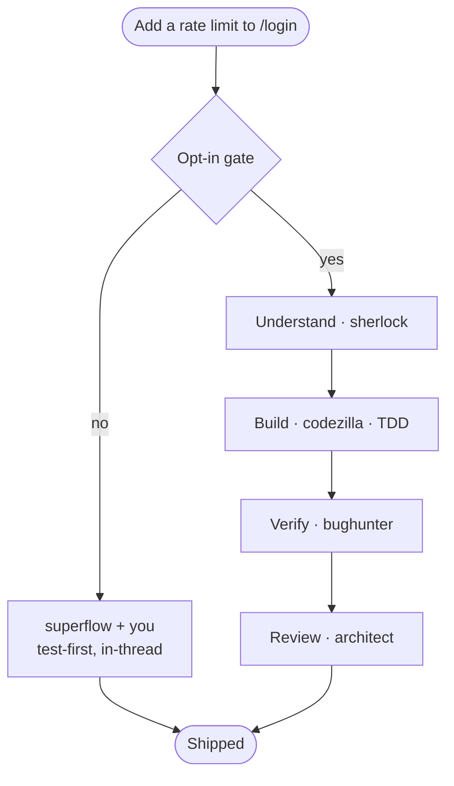
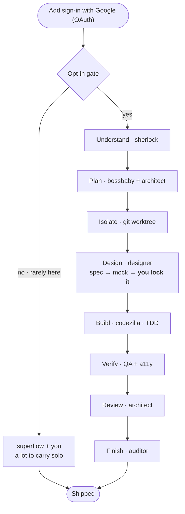
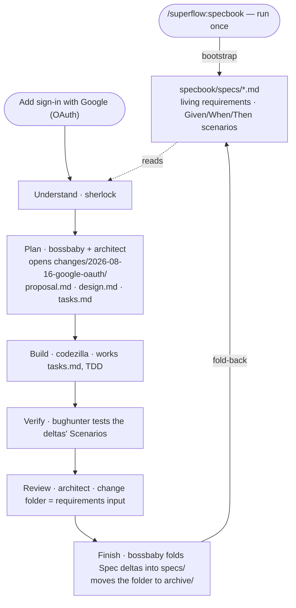

# superflow

superflow is a portable, self-contained Claude Code plugin that turns non-trivial coding work into a coherent pipeline — brainstorm → plan → build (TDD) → verify → review → finish — driven by specialist personas and disciplined by the battle-tested process skills of [Superpowers](https://github.com/obra/superpowers). It drops into **any** repository and adapts to that repo's conventions through a self-scanning `CODEBASE_RULEBOOK.md`, so it isn't tied to any particular stack.

## Install

You need [Claude Code](https://claude.com/claude-code) and git access to this repo. superflow ships as a **plugin marketplace**, so installing is two steps: register the marketplace, then install the plugin from it.

### In a Claude Code session

Type these as slash commands at the prompt:

```
/plugin marketplace add https://github.com/cashwanikumar/superflow
/plugin install superflow
```

Restart the session so the plugin's SessionStart hook fires. To confirm it loaded, run `/plugin` and check superflow is enabled — you should see 10 personas, 24 skills, and 2 workflows, all addressed as `superflow:<name>`.

### From the terminal

The same thing without opening a session — useful for scripting, CI images, and dotfiles:

```bash
claude plugin marketplace add https://github.com/cashwanikumar/superflow
claude plugin install superflow@superflow            # add --scope to control reach
claude plugin details superflow                      # inventory + projected token cost
```

`--scope` decides who gets it:

| Scope | Where it applies |
|---|---|
| `user` (default) | every repo you open |
| `project` | this repo, shared with your team via committed settings |
| `local` | this repo, your machine only (gitignored `.claude/settings.local.json`) |

### First run in a repo

Bootstrap the rulebook once — this is what teaches the generic personas your repo's conventions:

```
/superflow:codebase-rulebook
```

Optionally, opt the repo into the persistent spec layer:

```
/superflow:specbook
```

### Updating and removing

```bash
claude plugin marketplace update superflow    # pull the latest marketplace metadata
claude plugin update superflow                # restart required to apply
claude plugin uninstall superflow@superflow   # add the same --scope you installed with
```

Note that superflow never claims a bare command name — everything is `superflow:<name>`, so it can't shadow, or be shadowed by, commands and agents already in your `~/.claude/`.

## How it works

> **More detail:** [The Weave & the Specbook](docs/the-weave-and-the-specbook.md) — the pipeline, the spec layer, and the deterministic workflows, diagrammed · [Designing a Screen](docs/designing-a-screen.md) — the reduction gate and the mock-lock loop · [A Feature, Woven](docs/a-feature-woven.md) — one feature end to end, as a session diary.

superflow has **two tiers**. A cheap check runs on every turn and never spawns agents; the expensive half — the full process skills *and* the persona team — sits behind a single opt-in gate. So a quick question stays quick, and neither ingredient is invoked wholesale on work that doesn't need it.


**Saying "yes" runs the whole machine, automatically** — you don't pick skills. Each stage has a fixed skill+persona binding, so the process skills (`brainstorming`, `writing-plans`, `test-driven-development`, `using-git-worktrees`, `verification-before-completion`, `finishing-a-development-branch`…) load as their stage runs, and the matching personas spawn alongside. The gate is your cost control: `yes` is the expensive path, and it's what pulls in real git worktrees and the full pipeline.

The **task decides how much of the team shows up** — superflow runs the minimum. Two examples, same gate and same quality bar, but the `yes` branch grows with the work.

### Example 1 — a small change (4 of 9 stages)



### Example 2 — a full-stack feature (8 of 9 stages)



Only Debug sits out of the OAuth run (nothing's broken yet). The `no` branch is kept for symmetry; for a feature that size you'd almost always say `yes`.

### Example 3 — the same feature, with a specbook (opt-in)

With a `specbook/` present in the target repo (see below), Plan additionally writes the change folder (proposal / design / tasks) and Finish adds `bossbaby` to fold the change back into the living specs — so the requirements outlive the conversation.



A run that skips Plan (like Example 1) opens no change folder even with a specbook present — minimum-spawn survives the layer. No `specbook/` in the repo? Nothing changes at all.

## What's inside

- **10 personas** (`agents/`) — `sherlock`, `bossbaby`, `designer`, `codezilla`, `fe-unit-tester`, `be-unit-tester`, `bughunter`, `a11y-hunter`, `architect`, `auditor`. Read-only investigators, builders, testers, and reviewers, each spawned only when the task needs it.
- **24 skills** (`skills/`) — 14 process skills vendored verbatim from [Superpowers](https://github.com/obra/superpowers) (TDD, brainstorming, systematic-debugging, writing-plans, requesting/receiving-code-review, verification-before-completion, using-git-worktrees, finishing-a-development-branch, and more), plus the **`superflow`** front-door skill that weaves them together, plus 7 invocable commands: `/superflow:codebase-rulebook`, `/superflow:specbook`, `/superflow:commit-prep`, `/superflow:council`, `/superflow:design`, `/superflow:daily-brief`, `/superflow:handoff` — and 2 loaded on demand rather than typed: `ui-reduction` (the declutter method behind designer's gate) and `handoff-contracts` (JSON schemas so a persona→persona handoff fails loudly instead of degrading into lossy prose).
- **2 workflows** (`workflows/`) — deterministic scripts for the two calls expensive enough to be worth taking out of the model's hands. `/superflow:council` runs `council-vote`: every voice returns through a JSON schema, so a dropped or abstaining voice is *reported*, never silently missing from the tally. `/superflow:review-sweep` partitions a large diff into coherent slices, runs one `bughunter` per slice, then sends a dedicated skeptic at each finding — surviving findings come back tiered CONFIRMED (traced end to end) or PLAUSIBLE (undecidable from the code alone, and never dropped for want of a repro). Workflows need Dynamic workflows enabled; on Pro, turn them on in `/config`.
- **A mock-locked design loop** — `/superflow:design` takes a screen from spec to an interactive mock the user clicks and locks, and only then writes the build brief. **Specs propose; mocks decide.** On complex or cluttered screens, `designer` first walks the `ui-reduction` method — structure before styling, with a kept/moved/cut table so nothing disappears silently.
- **An optional commit gate** — a bare `git commit` can be blocked until it goes through `/superflow:commit-prep`. Off by default; see [Optional setup](#the-commit-gate).
- **The rulebook** — `/superflow:codebase-rulebook` scans the current repo and writes `CODEBASE_RULEBOOK.md`. This is the portability keystone: it's what lets the generic personas conform to *your* repo. `--refresh` to update it.
- **The specbook (opt-in)** — `/superflow:specbook` bootstraps `specbook/` in your repo: living per-capability specs with scenario acceptance criteria, plus a folder per change (proposal / design / tasks) archived and folded back into the specs at Finish. The rulebook says *how* your codebase builds; the specbook says *what* it must do. Activates only when the directory exists — superflow never creates it on its own, and headless runs never mention it.
- **Namespaced, always** — every skill and persona is addressed as `superflow:<name>`, so nothing collides with (or is silently shadowed by) commands and agents you already have in `~/.claude/`.
- **The superflow flow** — a SessionStart hook injects a short protocol each session: a lightweight always-on skill-check (brainstorming for builds, systematic-debugging for bugs, receiving-code-review for review feedback), then a **one-time opt-in gate** before the heavier multi-persona pipeline spawns — so cost stays under your control. Rulebook-first, minimum-spawn.
- **Works with or without a human in the loop** — interactive sessions get the opt-in question. Headless runs (`claude -p`, CI, coding agents) never stall on a question nobody can answer: superflow decides by rule and states which path it took. See below to pin the behavior.

## Optional setup

Everything below is off unless you turn it on. superflow works fully without any of it — these buy extra capability at the cost of installing or configuring something.

### External voices for the council

`/superflow:council` runs a persona-only roster by default: `architect`, `bughunter`, `codezilla`, `bossbaby`, plus `sherlock` grounding when the decision is code-tied. That costs nothing beyond the session.

You can additionally route votes through **other vendors' CLIs**, so a hard call gets judged by models that don't share Claude's blind spots. Install whichever CLIs you want (`codex`, `gemini`, `claude`), then declare them in `.claude/superflow.json` — repo-local, or `~/.claude/superflow.json` for all repos:

```json
{
  "providers": {
    "codex":  { "command": "codex exec", "model": "gpt-5.6-sol" },
    "gemini": { "command": "gemini -p",  "model": "gemini-2.5-pro" },
    "claude": { "command": "claude -p",  "model": "fable" }
  }
}
```

`claude` is a legitimate third entry, not a duplicate of the persona voices: it's a fresh `claude -p` subprocess with no shared context, which is a different thing from a persona spawned by the agent chairing the council. Model names go stale — each CLI only accepts its own set, so if one is rejected the workflow retries once without the `--model` flag rather than failing the voice.

Then ask for them by name — and only then:

```
/superflow:council should we move the runner off Celery — include codex and gemini
```

**These bill your own vendor accounts, so they are never added on your behalf.** The council skill confirms the spend with you before launching, the workflow refuses any provider you didn't explicitly name in that turn, and a provider is never carried over from an earlier council. A missing CLI returns an abstain with a reason, not a crash.

What the workflow does to each external voice, whether or not you ask for it:

- **Sanitizes before sending.** `.env*` contents, key/token patterns (`sk-*`, `AKIA*`, `ghp_*`, `xox*-*`, PEM blocks), credentialed connection strings, signed URLs, and anything from `/etc/`, `~/.ssh/`, `~/.aws/` are refused. If a pattern hits inside the constructed prompt, the run **aborts that voice** and returns an abstain naming the pattern *class* — never the secret.
- **Runs the CLI from an empty temp directory**, with its file tools disabled where the CLI supports it, so an agentic vendor CLI can't wander your repo on its own. The prompt goes in via a `chmod 600` temp file, deleted on success and failure alike.
- **Never silently drops a vote.** Unparseable output comes back as an abstain carrying the raw text; abstains are reported in the synthesis and never counted as votes. Each external voice also returns a one-line `sent_summary` — what was actually transmitted — for post-run audit.

### graphify (code graph)

`sherlock` and `bughunter` can use a local tree-sitter code graph to answer structure questions in one call instead of ten file reads — `sherlock` for "what does this symbol touch", `bughunter` for the reverse direction nobody checks by hand: "what breaks if this changes".

It is **optional and not bundled** — graphify is a Python package with native tree-sitter grammars, so it can't ride along in a markdown plugin. Install it yourself:

```bash
pipx install graphifyy
graphify extract . --code-only     # once per repo — builds graphify-out/
graphify update .                  # incremental refresh, seconds, no LLM
echo "graphify-out/" >> .gitignore
```

Without it, nothing breaks and nothing nags: both personas fall back to glob/grep silently and never ask you to install anything mid-task. The graph is an accelerator, not a requirement — and it gives you *structure*, never semantics, so anything load-bearing still gets read from the source.

### The commit gate

Off by default. Turn it on per repo and a bare `git commit` is blocked until it goes through `/superflow:commit-prep`:

```bash
export SUPERFLOW_COMMIT_GATE=1              # or: {"commitGate": true} in .claude/superflow.json
```

A prepared commit opts through by including the token `COMMIT_PREP_OK` in the command. It stays off by default because superflow installs at user scope, and a plugin that silently blocks commits in every repo you open is a hostile default.

## Unattended / headless runs

`SUPERFLOW_FLOW` controls the opt-in gate:

| Value | Behavior |
|---|---|
| `auto` (default) | Ask and wait when a human is present. Headless: don't ask — single-file changes fully covered by the rulebook run direct, anything larger runs the weave, and the choice is stated in one line. |
| `always` | Never ask; run the full weave on every non-trivial turn. |
| `never` | Never ask, never spawn personas; work directly (still rulebook-first). |

```
SUPERFLOW_FLOW=always claude -p "add the delete endpoint"
```

Pin it with `always`/`never` when you want unattended behavior to be deterministic rather than inferred. Note that superflow deliberately does *not* try to sniff whether a human is present from the hook — the SessionStart payload is identical in both modes and env vars leak into child sessions, so the decision is left to the agent, which actually knows.

There's no separate headless setup — same plugin, same hook, same skills fire either way. On `auto`, when the agent decides for itself (no one to ask), it states the choice as the first line of its reply, verbatim: `superflow: weave — <reason>` or `superflow: direct — <reason>`. That line is the only audit trail an unattended run leaves, so it's worth grepping CI logs for.

One thing `SUPERFLOW_FLOW` never touches: the specbook. Bootstrapping `specbook/` always requires you to run `/superflow:specbook` yourself, at least once, interactively — `always` doesn't make headless runs create it, and `never` isn't needed to suppress it. Headless runs simply never create or mention it, full stop.

## Resync Superpowers skills from upstream

The 14 vendored skills under `plugins/superflow/skills/` (everything except `superflow/`, `codebase-rulebook/`, `specbook/`, `commit-prep/`, `council/`, `daily-brief/`, `handoff/`, `design/`, `ui-reduction/`, and `handoff-contracts/`, which are ours) are copied verbatim from Superpowers and do **not** auto-update. To resync from upstream, copy the matching skill directories from the installed Superpowers plugin cache (or the [obra/superpowers](https://github.com/obra/superpowers) repo) over the ones here, keeping each skill's files intact. The `superflow/` skill is ours — don't overwrite it.

## Credits

**Built on [Superpowers](https://github.com/obra/superpowers)** by [Jesse Vincent (obra)](https://github.com/obra), MIT-licensed. The process discipline in superflow — TDD, brainstorming, systematic debugging, plan writing, code review, verification, git worktrees — is Superpowers' work, vendored here verbatim with its license intact. If you want the process skills on their own, install Superpowers directly.

superflow adds the persona layer, the rulebook, the specbook, the design and handoff contracts, the deterministic workflows, and the routing that decides which of them runs. The personas and the codebase-rulebook mechanism are a generalized fork of an internal agent-circus plugin. The `ui-reduction` skill's quick-diagnostic and severity-rating patterns are adapted from the MIT-licensed wondelai/skills `ux-heuristics` skill.

Full provenance: [ATTRIBUTION.md](ATTRIBUTION.md).
