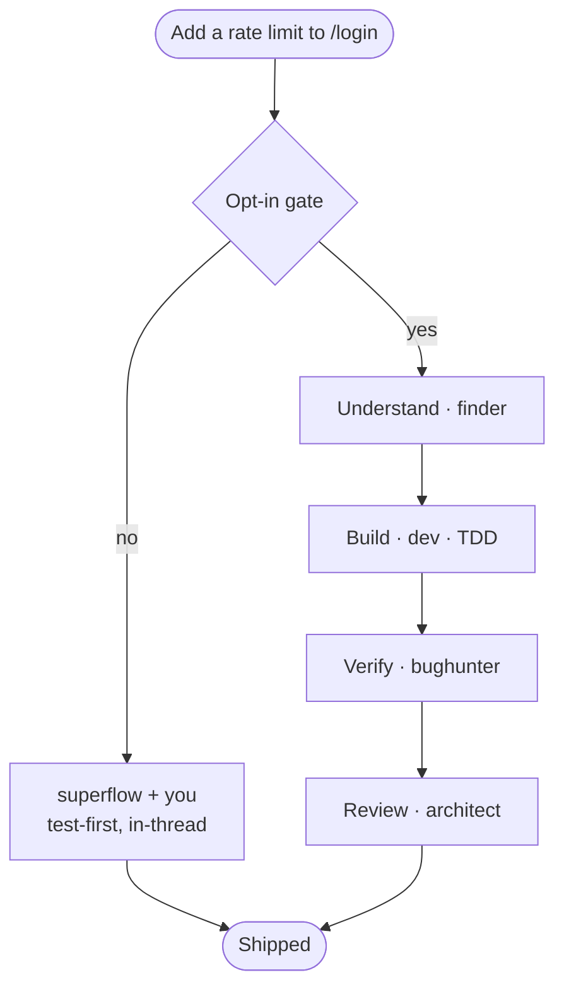
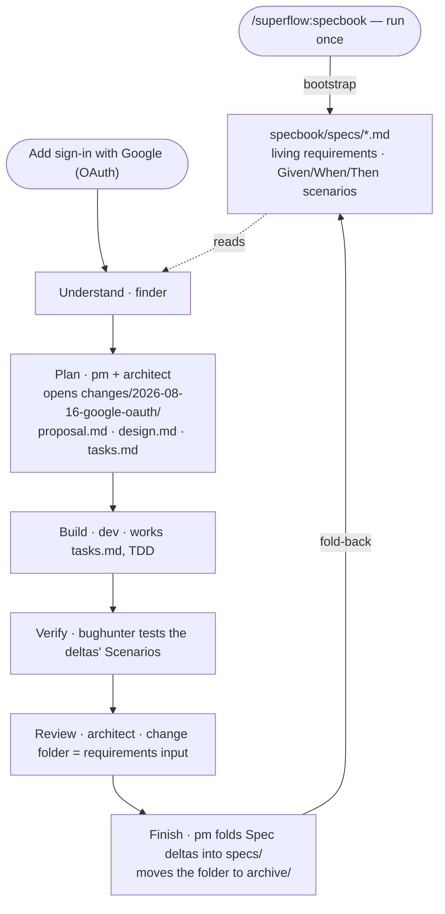

# superflow

superflow is a portable, self-contained Claude Code plugin that turns non-trivial coding work into a coherent pipeline — brainstorm → plan → build (TDD) → verify → review → finish — driven by specialist personas and disciplined by battle-tested process skills. It drops into **any** repository and adapts to that repo's conventions through a self-scanning `CODEBASE_RULEBOOK.md`, so it isn't tied to any particular stack.

> **Built on [Superpowers](https://github.com/obra/superpowers)** by [Jesse Vincent (obra)](https://github.com/obra), MIT-licensed. The process discipline in superflow — TDD, brainstorming, systematic debugging, plan writing, code review, verification, git worktrees — is Superpowers' work, vendored here verbatim with its license intact. superflow adds the persona layer, the rulebook, the specbook, and the routing that decides which of them runs. If you want the process skills on their own, install Superpowers directly. Full provenance: [ATTRIBUTION.md](ATTRIBUTION.md).

## How it works

> A visual walkthrough (interactive): **https://claude.ai/code/artifact/037be08d-120b-4026-aee4-513a8de6c773**
> Flowchart explainer, specbook included: **https://claude.ai/code/artifact/4419409a-3be8-407a-85bc-4ac697c44156**
> A session diary — one feature end to end: **https://claude.ai/code/artifact/c7fb4f0a-e98a-494d-b63c-1af06eaef45f**
> _(private artifacts — open the share menu on a page to let others view it.)_

superflow has **two tiers**. A cheap check runs on every turn and never spawns agents; the expensive half — the full process skills *and* the persona team — sits behind a single opt-in gate. So a quick question stays quick, and neither ingredient is invoked wholesale on work that doesn't need it.


**Saying "yes" runs the whole machine, automatically** — you don't pick skills. Each stage has a fixed skill+persona binding, so the process skills (`brainstorming`, `writing-plans`, `test-driven-development`, `using-git-worktrees`, `verification-before-completion`, `finishing-a-development-branch`…) load as their stage runs, and the matching personas spawn alongside. The gate is your cost control: `yes` is the expensive path, and it's what pulls in real git worktrees and the full pipeline.

The **task decides how much of the team shows up** — superflow runs the minimum. Two examples, same gate and same quality bar, but the `yes` branch grows with the work.

### Example 1 — a small change (4 of 9 stages)



### Example 2 — a full-stack feature (8 of 9 stages)


Only Debug sits out of the OAuth run (nothing's broken yet). The `no` branch is kept for symmetry; for a feature that size you'd almost always say `yes`.

### Example 3 — the same feature, with a specbook (opt-in)

With a `specbook/` present in the target repo (see below), Plan additionally writes the change folder (proposal / design / tasks) and Finish adds `pm` to fold the change back into the living specs — so the requirements outlive the conversation.



A run that skips Plan (like Example 1) opens no change folder even with a specbook present — minimum-spawn survives the layer. No `specbook/` in the repo? Nothing changes at all.

## Install

You need [Claude Code](https://claude.com/claude-code) and git access to this repo. superflow ships as a **plugin marketplace**, so installing is two steps: register the marketplace, then install the plugin from it.

### In a Claude Code session

Type these as slash commands at the prompt:

```
/plugin marketplace add https://github.com/cashwanikumar/superflow
/plugin install superflow
```

Restart the session so the plugin's SessionStart hook fires. To confirm it loaded, run `/plugin` and check superflow is enabled — you should see 10 personas and 21 skills, all addressed as `superflow:<name>`.

### From the terminal

The same thing without opening a session — useful for scripting, CI images, and dotfiles:

```bash
claude plugin marketplace add https://github.com/cashwanikumar/superflow
claude plugin install superflow@superflow            # add --scope to control reach
claude plugin details superflow                      # inventory + projected token cost
```

`--scope` decides who gets it:

| Scope | Where it applies |
|---|---|
| `user` (default) | every repo you open |
| `project` | this repo, shared with your team via committed settings |
| `local` | this repo, your machine only (gitignored `.claude/settings.local.json`) |

### First run in a repo

Bootstrap the rulebook once — this is what teaches the generic personas your repo's conventions:

```
/superflow:codebase-rulebook
```

Optionally, opt the repo into the persistent spec layer:

```
/superflow:specbook
```

### Updating and removing

```bash
claude plugin marketplace update superflow    # pull the latest marketplace metadata
claude plugin update superflow                # restart required to apply
claude plugin uninstall superflow@superflow   # add the same --scope you installed with
```

Note that superflow never claims a bare command name — everything is `superflow:<name>`, so it can't shadow, or be shadowed by, commands and agents already in your `~/.claude/`.

## What's inside

- **10 personas** (`agents/`) — `finder`, `pm`, `designer`, `dev`, `fe-unit-tester`, `be-unit-tester`, `bughunter`, `a11y-hunter`, `architect`, `auditor`. Read-only investigators, builders, testers, and reviewers, each spawned only when the task needs it.
- **21 skills** (`skills/`) — 14 process skills vendored verbatim from [Superpowers](https://github.com/obra/superpowers) (TDD, brainstorming, systematic-debugging, writing-plans, requesting/receiving-code-review, verification-before-completion, using-git-worktrees, finishing-a-development-branch, and more), plus the **`superflow`** front-door skill that weaves them together, plus 6 invocable workflow skills: `/superflow:codebase-rulebook`, `/superflow:specbook`, `/superflow:commit-prep`, `/superflow:council`, `/superflow:daily-brief`, `/superflow:handoff`.
- **The rulebook** — `/superflow:codebase-rulebook` scans the current repo and writes `CODEBASE_RULEBOOK.md`. This is the portability keystone: it's what lets the generic personas conform to *your* repo. `--refresh` to update it.
- **The specbook (opt-in)** — `/superflow:specbook` bootstraps `specbook/` in your repo: living per-capability specs with scenario acceptance criteria, plus a folder per change (proposal / design / tasks) archived and folded back into the specs at Finish. The rulebook says *how* your codebase builds; the specbook says *what* it must do. Activates only when the directory exists — superflow never creates it on its own, and headless runs never mention it.
- **Namespaced, always** — every skill and persona is addressed as `superflow:<name>`, so nothing collides with (or is silently shadowed by) commands and agents you already have in `~/.claude/`.
- **The superflow flow** — a SessionStart hook injects a short protocol each session: a lightweight always-on skill-check (brainstorming for builds, systematic-debugging for bugs, receiving-code-review for review feedback), then a **one-time opt-in gate** before the heavier multi-persona pipeline spawns — so cost stays under your control. Rulebook-first, minimum-spawn.
- **Works with or without a human in the loop** — interactive sessions get the opt-in question. Headless runs (`claude -p`, CI, coding agents) never stall on a question nobody can answer: superflow decides by rule and states which path it took. See below to pin the behavior.

## Unattended / headless runs

`SUPERFLOW_FLOW` controls the opt-in gate:

| Value | Behavior |
|---|---|
| `auto` (default) | Ask and wait when a human is present. Headless: don't ask — single-file changes fully covered by the rulebook run direct, anything larger runs the weave, and the choice is stated in one line. |
| `always` | Never ask; run the full weave on every non-trivial turn. |
| `never` | Never ask, never spawn personas; work directly (still rulebook-first). |

```
SUPERFLOW_FLOW=always claude -p "add the delete endpoint"
```

Pin it with `always`/`never` when you want unattended behavior to be deterministic rather than inferred. Note that superflow deliberately does *not* try to sniff whether a human is present from the hook — the SessionStart payload is identical in both modes and env vars leak into child sessions, so the decision is left to the agent, which actually knows.

There's no separate headless setup — same plugin, same hook, same skills fire either way. On `auto`, when the agent decides for itself (no one to ask), it states the choice as the first line of its reply, verbatim: `superflow: weave — <reason>` or `superflow: direct — <reason>`. That line is the only audit trail an unattended run leaves, so it's worth grepping CI logs for.

One thing `SUPERFLOW_FLOW` never touches: the specbook. Bootstrapping `specbook/` always requires you to run `/superflow:specbook` yourself, at least once, interactively — `always` doesn't make headless runs create it, and `never` isn't needed to suppress it. Headless runs simply never create or mention it, full stop.

## Resync Superpowers skills from upstream

The 14 vendored skills under `plugins/superflow/skills/` (everything except `superflow/`, `codebase-rulebook/`, `specbook/`, `commit-prep/`, `council/`, `daily-brief/`, and `handoff/`, which are ours) are copied verbatim from Superpowers and do **not** auto-update. To resync from upstream, copy the matching skill directories from the installed Superpowers plugin cache (or the [obra/superpowers](https://github.com/obra/superpowers) repo) over the ones here, keeping each skill's files intact. The `superflow/` skill is ours — don't overwrite it.

## Credits

Process skills are vendored from Superpowers (Jesse Vincent / obra, MIT). The personas and the codebase-rulebook mechanism are a generalized fork of an internal agent-circus plugin. See [ATTRIBUTION.md](ATTRIBUTION.md).
