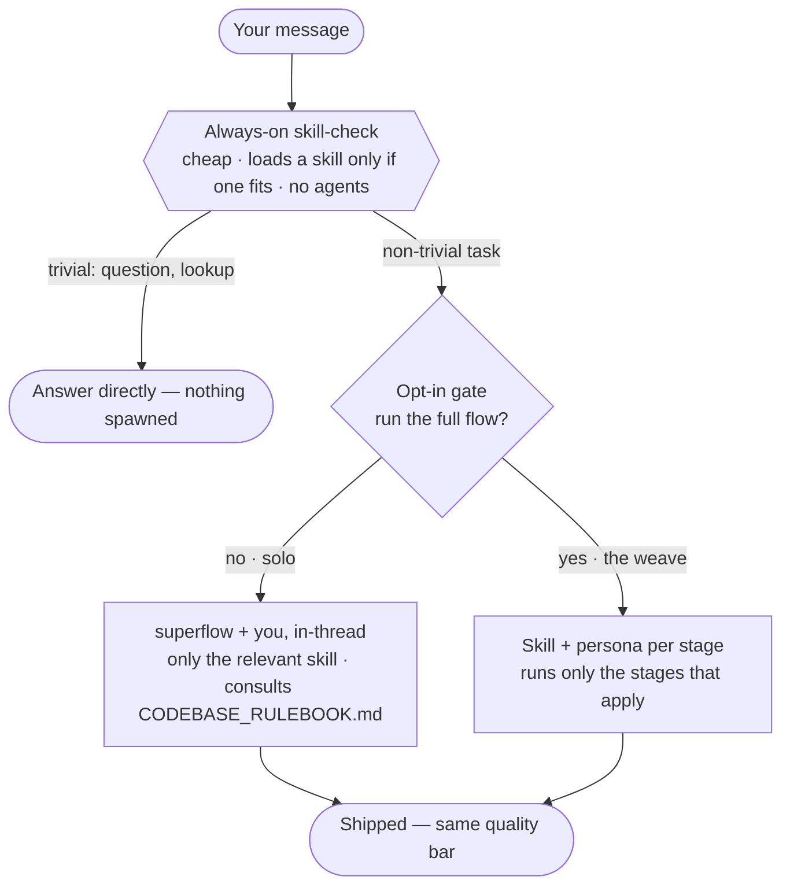
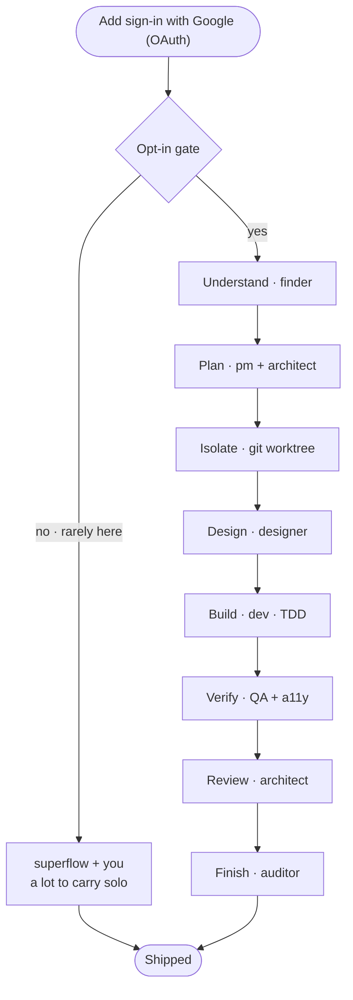

# superflow

superflow is a portable, self-contained Claude Code plugin that turns non-trivial coding work into a coherent pipeline — brainstorm → plan → build (TDD) → verify → review → finish — driven by specialist personas and disciplined by battle-tested process skills. It drops into **any** repository and adapts to that repo's conventions through a self-scanning `CODEBASE_RULEBOOK.md`, so it isn't tied to any particular stack.

## How it works

> A visual walkthrough (interactive): **https://claude.ai/code/artifact/037be08d-120b-4026-aee4-513a8de6c773**
> _(private artifact — open the share menu on that page to let others view it.)_

superflow has **two tiers**. A cheap check runs on every turn and never spawns agents; the expensive half — the full process skills *and* the persona team — sits behind a single opt-in gate. So a quick question stays quick, and neither ingredient is invoked wholesale on work that doesn't need it.



**Saying "yes" runs the whole machine, automatically** — you don't pick skills. Each stage has a fixed skill+persona binding, so the process skills (`brainstorming`, `writing-plans`, `test-driven-development`, `using-git-worktrees`, `verification-before-completion`, `finishing-a-development-branch`…) load as their stage runs, and the matching personas spawn alongside. The gate is your cost control: `yes` is the expensive path, and it's what pulls in real git worktrees and the full pipeline.

The **task decides how much of the team shows up** — superflow runs the minimum. Two examples, same gate and same quality bar, but the `yes` branch grows with the work.

### Example 1 — a small change (4 of 9 stages)


### Example 2 — a full-stack feature (8 of 9 stages)



Only Debug sits out of the OAuth run (nothing's broken yet). The `no` branch is kept for symmetry; for a feature that size you'd almost always say `yes`.

## Install

```
/plugin marketplace add https://github.com/cashwanikumar/superflow
/plugin install superflow
```

Then, in a new repo, bootstrap the rulebook once:

```
/codebase-rulebook
```

## What's inside

- **10 personas** (`agents/`) — `finder`, `pm`, `designer`, `dev`, `fe-unit-tester`, `be-unit-tester`, `bughunter`, `a11y-hunter`, `architect`, `auditor`. Read-only investigators, builders, testers, and reviewers, each spawned only when the task needs it.
- **15 skills** (`skills/`) — 14 process skills vendored verbatim from [Superpowers](https://github.com/obra/superpowers) (TDD, brainstorming, systematic-debugging, writing-plans, requesting/receiving-code-review, verification-before-completion, using-git-worktrees, finishing-a-development-branch, and more), plus the new **`superflow`** front-door skill that weaves them together.
- **The rulebook** — `/codebase-rulebook` scans the current repo and writes `CODEBASE_RULEBOOK.md`. This is the portability keystone: it's what lets the generic personas conform to *your* repo. `--refresh` to update it.
- **5 commands** (`commands/`) — `/codebase-rulebook`, `/commit-prep`, `/council`, `/daily-brief`, `/handoff`.
- **The superflow flow** — a SessionStart hook injects a short protocol each session: a lightweight always-on skill-check (brainstorming for builds, systematic-debugging for bugs, receiving-code-review for review feedback), then a **one-time opt-in gate** before the heavier multi-persona pipeline spawns — so cost stays under your control. Rulebook-first, minimum-spawn.

## Resync Superpowers skills from upstream

The 14 vendored skills under `plugins/superflow/skills/` (everything except `superflow/`) are copied verbatim from Superpowers and do **not** auto-update. To resync from upstream, copy the matching skill directories from the installed Superpowers plugin cache (or the [obra/superpowers](https://github.com/obra/superpowers) repo) over the ones here, keeping each skill's files intact. The `superflow/` skill is ours — don't overwrite it.

## Credits

Process skills are vendored from Superpowers (Jesse Vincent / obra, MIT). The personas and the codebase-rulebook mechanism are a generalized fork of an internal agent-circus plugin. See [ATTRIBUTION.md](ATTRIBUTION.md).
