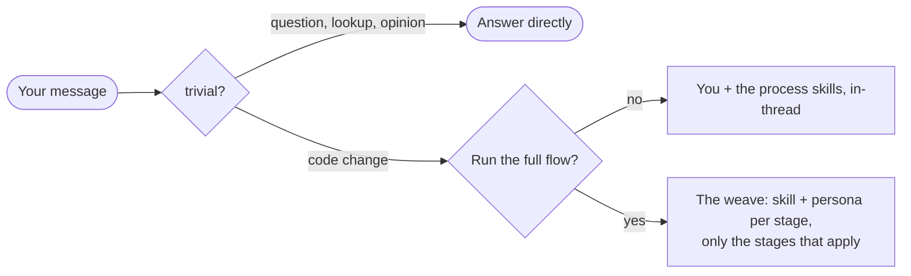

# superflow

A portable Claude Code plugin that turns non-trivial coding work into one pipeline — brainstorm → plan → build (TDD) → verify → review — run by five specialist personas and disciplined by the process skills of [Superpowers](https://github.com/obra/superpowers). It fits any repo by scanning that repo's own conventions into a `CODEBASE_RULEBOOK.md`.

## Install

```
/plugin marketplace add https://github.com/cashwanikumar/superflow
/plugin install superflow
```

Or from the terminal:

```bash
claude plugin marketplace add https://github.com/cashwanikumar/superflow
claude plugin install superflow@superflow      # add --scope to control reach
```

| `--scope` | Where it applies |
|---|---|
| `user` (default) | every repo you open |
| `project` | this repo, shared with your team via committed settings |
| `local` | this repo, your machine only (gitignored `.claude/settings.local.json`) |

Restart the session so the SessionStart hook fires; `/plugin` should show superflow with 5 personas, 15 skills, 2 workflows, all addressed as `superflow:<name>`. The hook's first token is the running version (`[superflow 0.10.0]`) — if it doesn't match the repo, a stale scoped copy is winning (see below).

Then, once per repo:

```
/superflow:codebase-rulebook
```

That writes `CODEBASE_RULEBOOK.md` — the conventions every persona conforms to. Without it the personas are generic; with it they fit your codebase.

```bash
claude plugin marketplace update superflow           # pull the latest marketplace metadata
claude plugin update superflow@superflow             # restart required to apply
claude plugin uninstall superflow@superflow          # add the same --scope you installed with
```

`update` and `uninstall` need the **`@superflow` marketplace suffix** — the bare name resolves for `install` and `details` but not for these. Both default to `--scope user`: if you installed at `project` or `local` scope, pass the same `--scope` again, or that copy stays on the old version — and local/project take precedence over user, so a stale one wins silently.

## How it works

Every turn gets a cheap check; the expensive part sits behind one gate.



**The weave**, in order; each stage is skipped when it doesn't apply:

| Stage | Process skill | Persona |
|---|---|---|
| Understand | brainstorming | `sherlock` (read-only map) |
| Plan | writing-plans | `architect` (design; what & why already settled with you in brainstorming) |
| Isolate | using-git-worktrees | — |
| Design (UI) | design · ui-reduction | `designer` → mock you click and lock |
| Build + unit tests | test-driven-development | `codezilla` |
| Verify | verification-before-completion | `bughunter` (functional · convention · security · a11y) |
| Review | requesting/receiving-code-review | `architect` |
| Debug | systematic-debugging | `sherlock` → `bughunter` |

A one-line fix runs three stages; a full-stack feature runs all of them. Saying **yes** is the cost control — it's what spawns personas and pulls in worktrees.

Two calls are expensive enough to be scripted rather than left to the model:

- `/superflow:council` — a hard, expensive-to-reverse decision. Independent schema-forced votes from `architect`, `bughunter`, `codezilla` and a product-owner lens; `architect` synthesizes. A dropped or abstaining voice is reported, never silently missing.
- `/superflow:review-sweep` — epic gates and diffs over ~5 files. The diff is partitioned, one `bughunter` per slice, then a dedicated skeptic per finding. Survivors come back **CONFIRMED** (traced end to end) or **PLAUSIBLE** (undecidable from code alone, never dropped for want of a repro). Needs Dynamic workflows enabled (`/config` on Pro).

Other commands: `/superflow:design` (spec → interactive mock → build brief), `/superflow:handoff` (write one at the end of a session, `resume` at the start).

## Unattended runs

`SUPERFLOW_FLOW` controls the opt-in gate:

| Value | Behavior |
|---|---|
| `auto` (default) | Ask once per session before the first persona spawn, remember the answer. A run that cannot return a reply (`-p`, CI) works **direct** — rulebook-first, skills, no personas — and says so in one line. |
| `always` | Never ask; run the full weave on every non-trivial turn. |
| `never` | Never ask, never spawn personas; work directly (still rulebook-first). |

```
SUPERFLOW_FLOW=always claude -p "add the delete endpoint"
```

Pin `always` or `never` for unattended runs where you want deterministic behavior. Headless runs never commit on your behalf; the one file they may write is `CODEBASE_RULEBOOK.md` when it is missing, and the final message says so.

## Optional setup

Everything below is off unless you turn it on.

### graphify (code graph)

`sherlock` and `bughunter` can use a local tree-sitter code graph to answer structure questions in one call instead of ten file reads — "what does this symbol touch" and the reverse nobody checks by hand, "what breaks if this changes". Not bundled (native grammars can't ride along in a markdown plugin):

```bash
pipx install graphifyy
graphify extract . --code-only     # once per repo — builds graphify-out/
graphify update .                  # incremental refresh, seconds, no LLM
echo "graphify-out/" >> .gitignore
```

Without it, both personas fall back to grep silently and never ask you to install anything mid-task. The graph gives you *structure*, never semantics — anything load-bearing still gets read from the source.

## Resync the vendored skills

The 9 skills copied from Superpowers (`brainstorming`, `finishing-a-development-branch`, `receiving-code-review`, `requesting-code-review`, `systematic-debugging`, `test-driven-development`, `using-git-worktrees`, `verification-before-completion`, `writing-plans`) do not auto-update. Refresh them with one command:

```bash
scripts/resync-superpowers.sh                      # from the newest Superpowers in your plugin cache
scripts/resync-superpowers.sh /path/to/superpowers # or from a checkout
```

It copies the nine directories, rewrites `superpowers:` → `superflow:`, re-applies superflow's local edits from `scripts/superpowers-local-edits.patch`, fails loudly if any reference points at a skill this plugin does not ship, and records the upstream version in `ATTRIBUTION.md`. Review the diff, then commit.

Upstream skills intentionally **not** vendored: `using-superpowers` (its three operative sentences live in the `superflow` skill §1), `writing-skills`, `subagent-driven-development` and `dispatching-parallel-agents` (the weave owns the dispatch). Install Superpowers itself if you want them.

## Credits

Built on [Superpowers](https://github.com/obra/superpowers) by Jesse Vincent (obra), MIT. superflow adds the personas, the rulebook, the design loop, the two workflows, and the routing. The personas and the rulebook mechanism are a generalized fork of an internal agent-circus plugin; the `ui-reduction` skill's quick-diagnostic and severity patterns are adapted from the MIT-licensed wondelai/skills `ux-heuristics` skill. Docs: [Designing a Screen](docs/designing-a-screen.md). Provenance: [ATTRIBUTION.md](ATTRIBUTION.md).
