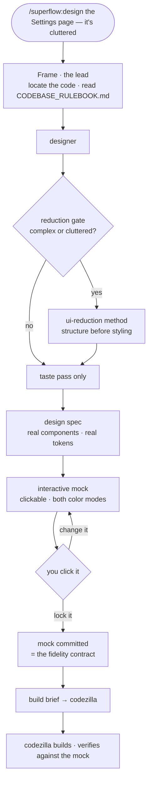

# Designing a Screen

How superflow gets from *"this page is a mess"* to code someone can trust — and why there's a human checkpoint in the middle of it.

> Applies to superflow 0.5+. Companion pages: [The Weave & the Specbook](the-weave-and-the-specbook.md) · [A Feature, Woven](a-feature-woven.md).

---

## The one rule

**Specs propose. Mocks decide.**

A design spec is a claim about how a screen will feel. You cannot verify that claim by reading it — layout *feel* is decided by clicking, never by prose. So superflow doesn't hand a spec to the implementer. It builds an interactive mock from the spec, you click it until it's right, and **the locked mock outranks the spec wherever the two disagree.**

Everything below exists to serve that ordering.



---

## Stage 1 — Framing (the lead)

Before `designer` is spawned, the lead locates the screen's code, names the job(s) it does, and reads the constraints that will decide whether a spec is even buildable: `CODEBASE_RULEBOOK.md`'s design-system rules, import bans, lint rules. If a `specbook/` exists, the affected capability spec too.

This is why a generic designer persona can produce a spec that fits *your* repo — it isn't guessing at your design system, it's been pointed at it.

## Stage 2 — The reduction gate (designer decides)

`designer` decides whether the screen needs restructuring before it needs styling. The lead does **not** pre-empt this.

The gate fires when the screen is multi-section, visibly cluttered, does more than one job, or you said anything like *simplify / declutter / messy*. When it fires, `designer` loads the `ui-reduction` skill and walks it in order — **the most common failure is jumping to rearranging before cutting, which produces a tidier version of the same clutter.**

| Step | What happens |
|---|---|
| **0. Quick diagnostic** | Five pass/fail questions (one obvious primary action? purpose clear in ~5s? every control needed on most visits? nesting ≤2 deep? controls grouped and labeled?). All five pass → skip to taste. Any fail → run the method. |
| **1. Inventory** | Every element on the screen, read **from the component code**, with the task it serves and how often users need it. |
| **2. Diagnose** | Name the source of complexity: co-equal tasks · flat ungrouped pile · deep nesting · redundant paths. The fix differs per source, so a wrong diagnosis produces the wrong redesign. |
| **3. Reduce before rearrange** | **CUT** unused/duplicate/decorative → **DEFER** the rare stuff behind disclosure → only then arrange. Deleting beats tidying: a moved element still costs attention, a cut one costs nothing. |
| **4. Rank and layer** | Frequency × importance. never → cut · rarely → Layer 3 · sometimes → Layer 2 · every visit → primary. Two "primary" tasks means the screen should be split. |
| **5. Structural moves** | In descending leverage: split the screen · flatten nesting · chunk into task-named groups · smart defaults · exactly one primary action. |
| **6. Account for everything** | Every inventoried element lands in **KEPT / MOVED / CUT**, each with a severity 0–4. Nothing vanishes silently. |
| **7. Output** | Diagnosis + ASCII wireframe + the reconciliation table — **before any styling.** |

The reconciliation table is the part that makes a reduction reviewable:

| Element | Disposition | Where / why | Severity |
|---|---|---|---|
| "Export CSV" button | MOVED | → row overflow menu (used ~monthly) | 1 |
| Duplicate "Save" in header | CUT | Same action as the footer primary | 2 |
| Filter bar | KEPT | Layer 1 — used every visit | 0 |

An unaddressed severity-4 is a failed reduction. A table of only 0s and 1s means the screen needed polish, not reduction — and `designer` should say so rather than restructuring for its own sake.

## Stage 3 — Taste, on top of structure

Only once the structure is settled does `designer` style it. The explicit enemy here is UI that is correct but generic:

- **Spend boldness in one place.** One focal point dominates; everything else stays quiet.
- **Structure encodes, doesn't decorate.** Every border, card, and divider must clarify hierarchy — otherwise cut it.
- **One accent, locked**, used only for the primary/active state.
- **Refuse the slop tells:** gradients, glassmorphism, emoji-as-icons, three-equal-cards, shadow-on-everything.

And it must be **grounded**: real component names, real variants, real tokens discovered from your design system. A spec your repo's lint rules can't build is a failed spec. New primitives may be *proposed* as handoff items — never spec'd as inline hacks.

## Stage 4 — The mock, and the lock

The lead builds a self-contained clickable HTML mock from the spec, using your real tokens, in both color modes, with the key interactions wired.

Then you click it. Each round: you react, the mock updates in place. **Where the evolving mock and the original spec disagree, the mock wins.** If the spec changed navigation structure, expect to pivot — that's the stage doing its job.

On lock, the mock is committed to the repo (`docs/mocks/<slug>.html`) as the **fidelity contract**, and only then is the build brief written — derived from the locked mock, not from the spec. A brief written against an unlocked spec is premature and gets thrown away when the mock evolves.

> **Headless runs** skip the iteration loop, build the mock, commit it, and say plainly that it was never human-locked. A mock nobody clicked is a proposal, not a contract.

## Stage 5 — The build brief

What `codezilla` receives is deliberately concrete — files, components, variants, tokens, named explicitly:

```
## Implementation brief — Settings

### Files to change          ### Fidelity contract
### Design-system prerequisites (do these in the design-system package FIRST)
### Structure                (final layout + ASCII wireframe)
### Element disposition      (the kept/moved/cut table — verbatim)
### Component + token mapping
### States                   (empty / loading / error / disabled)
### Rules                    (rulebook conformance · run the checks)
### Acceptance               (3–6 checkable statements)
```

Two rules travel with it. `codezilla` **must not re-add cut elements or drop moved ones** — that's what the disposition table is for. And green tests aren't enough: the screen gets loaded in the running app, in both color modes, and compared against the locked mock.

---

## When not to use this

If the screen is trivial — one control, a copy tweak, a spacing nudge — say so and hand `codezilla` a one-paragraph brief. No mock, no reduction, no ceremony. The gate exists so the heavy path fires when it's earned, not on every visual change.
