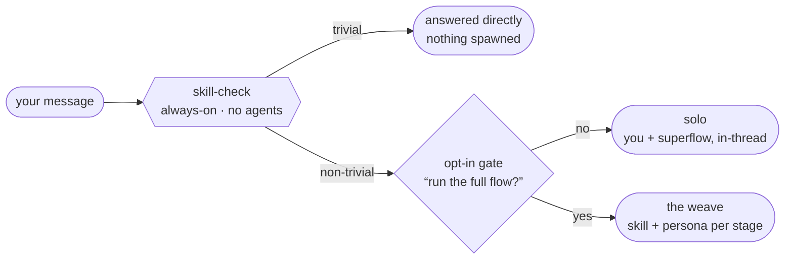
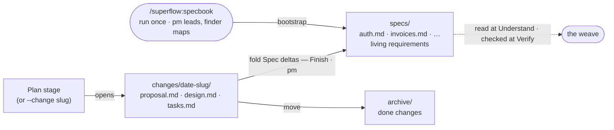
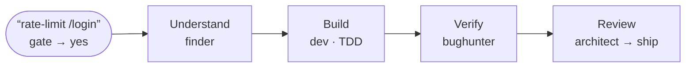
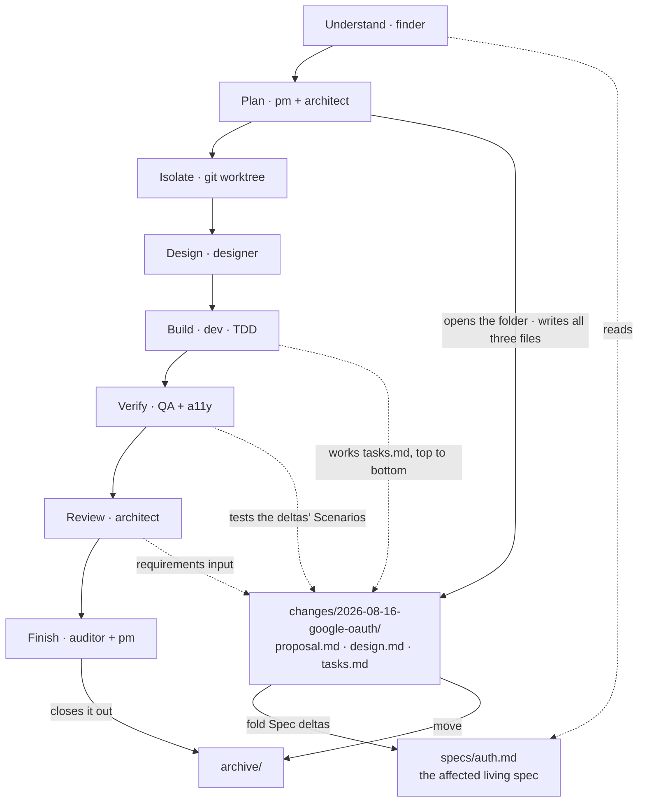
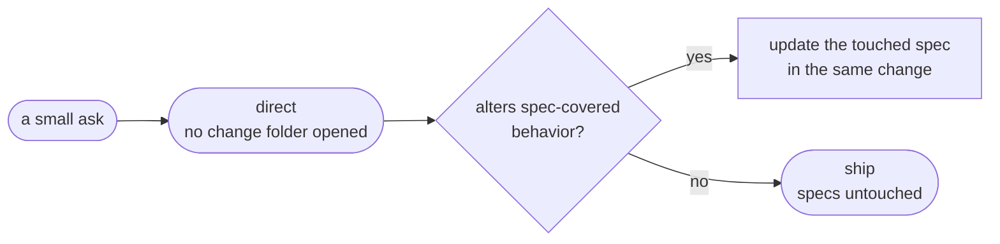
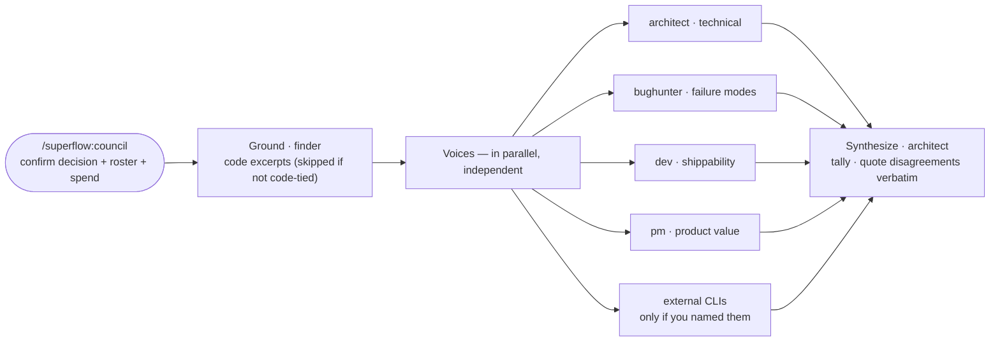
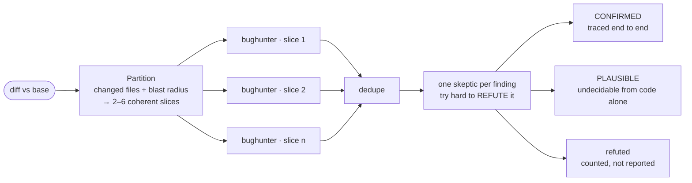

# The Weave & the Specbook

superflow turns non-trivial coding work into a staged pipeline of process skills and specialist personas. It can also keep a **specbook** — a durable spec layer in your repo, so requirements outlive the conversation. Here is how the pieces move, with worked examples.

> Sections 1–5 were written against superflow 0.4 and are unchanged in 0.5. Section 6 covers the deterministic workflows 0.5 added. The design loop has its own page: [Designing a Screen](designing-a-screen.md).

---

## 1. Two tiers, one gate

A cheap check runs on every message and never spawns agents. The expensive half — full process skills plus the persona team — sits behind a single opt-in.



**Saying yes runs the whole machine.** Each stage has a fixed skill-plus-persona binding, and the task decides how many of the nine stages show up. If `specbook/` exists in the repo, the session-start hook has already said so — both the solo path and the weave read it. Headless runs never see the question: the policy (`SUPERFLOW_FLOW`) decides, and the transcript opens with the choice.

---

## 2. The specbook — requirements that outlive the chat

Opt-in, once per repo. Everything superflow used to know only in the conversation now has a place on disk.

| | |
|---|---|
| **`CODEBASE_RULEBOOK.md`** | Conventions. *How* this repo builds things — stack, layout, test setup, lint rules. Written by `auditor`. |
| **`specbook/`** | Requirements. *What* the system must do — living per-capability specs with Given/When/Then scenarios. Written by `pm`. |

```
specbook/
├── README.md                        # orientation + path preferences
├── specs/                           # living requirements, one file per capability
│   ├── auth.md                      #   R1, R2… each with Given/When/Then scenarios
│   └── invoices.md
├── changes/                         # one folder per in-flight change
│   └── 2026-08-16-google-oauth/
│       ├── proposal.md              #   pm — what & why + Spec deltas
│       ├── design.md                #   technical design (brainstorming lands here)
│       └── tasks.md                 #   checkbox plan (writing-plans lands here)
└── archive/                         # finished changes, moved after fold-back
```



**The fold-back is the whole point.** A proposal writes its requirements as *Spec deltas* — the future spec text, in full. At Finish, `pm` applies those deltas to `specs/` verbatim and archives the folder, so the living specs always describe the shipped system. `auditor` still writes only the rulebook; the two never touch each other's files.

Activation is a single directory check: no `specbook/`, no spec behavior. superflow will mention the option at most once per interactive session and never creates the directory on its own — a repo that hasn't opted in pays zero overhead.

---

## 3. Three runs, same machine

### Example 1 — a small change, no specbook

"Add a rate limit to `/login`" in a repo that never opted in. Four of nine stages; nothing else changes.



**4 of 9 stages.** Plan is skipped for a single-capability change — and since a change folder is opened only by the Plan stage, a run this small would create no folder *even in a repo with a specbook*. Minimum-spawn survives the new layer.

### Example 2 — a full feature, specbook present

"Add sign-in with Google (OAuth)" in a repo that opted in. Eight stages run — and now each one reads or writes something durable.



**8 of 9 stages** (only Debug sits out — nothing is broken yet). The top chain is the weave; the bottom band is what the specbook adds. Plan leaves three files a human can read and edit *before any code exists*; Verify gets scenarios instead of guesses; and Finish leaves `specs/auth.md` updated to describe the system that actually shipped. Solid arrows write, dashed arrows read.

### Example 3 — direct work under a specbook

Not every change earns the weave. The drift rule keeps small changes honest without spawning anyone.



**Specs stay true even off the weave.** Headless variant: instead of stalling to ask, the run states the drift in its final message — same honesty posture as the rulebook-violation rule.

---

## 4. Unattended runs

`SUPERFLOW_FLOW` still controls the gate. The specbook adds one axis: whether the directory exists.

| Mode | `specbook/` present | `specbook/` absent |
|---|---|---|
| `auto` (default) | Weave writes change folders; direct work reads specs and notes drift in the final message instead of stalling. | Interactive: one line, once — "`/superflow:specbook` bootstraps a spec layer if you want one." Headless: silence — never mentioned, never created. |
| `always` | Every non-trivial turn runs the weave, spec-aware. | Silence, never created. |
| `never` | No personas — but direct work still consults affected specs and notes drift. | Silence, never created. |

---

## 5. The specbook command surface

| Command | What it does |
|---|---|
| `/superflow:specbook` | bootstrap — pm + finder derive baseline capability specs from the codebase |
| `/superflow:specbook --refresh [capability]` | re-derive vs current code; `<!-- human-edited -->` sections survive |
| `/superflow:specbook --change <slug>` | open a change folder by hand (the Plan stage normally does this) |
| `/superflow:specbook --archive <slug>` | fold Spec deltas into `specs/`, move the folder to `archive/` |
| `/superflow:specbook --dry-run` | combinable with any form — show, don't write |

---

## 6. Deterministic workflows

Two calls are expensive enough to be worth taking out of the model's hands and into a script. Both are opt-in; neither runs itself.

The reason isn't speed — it's that a prose procedure fails **silently**. A council where one voice never got asked, or a review where one slice of the diff was quietly skipped, produces output that looks complete. A script can't skip a step and not show it.

### `/superflow:council` — a decision, not a build

For hard, expensive-to-reverse calls. The skill is the front door: it confirms the decision text (one sentence, passed verbatim to every voice) and the roster, then launches the `council-vote` workflow.



Every vote returns through a JSON schema, so an abstain or a dead voice is **reported**, never missing from the tally. Abstains are never counted as votes and never discarded — an unparseable answer comes back carrying its raw text, because it can still contain signal. The final verdict is `architect`'s call, not a vote count; a verdict that diverges from the majority has to say why.

External model CLIs can join as extra voices — they bill your own vendor accounts, so they're added only when you name them in that turn. See [Optional setup](../README.md#external-voices-for-the-council) for the config and the sanitization rules.

### `/superflow:review-sweep` — an adversarial review of a big diff

For epic gates and diffs larger than ~5 files. A run is expensive; small PRs get a plain `bughunter` pass instead.



Two design choices matter here. **Every changed file lands in a slice or is listed as left out with a reason** — silent partial coverage would read as "reviewed everything." And **PLAUSIBLE findings are never dropped for want of a reproduction**: integration-seam bugs (caller/callee drift, schema drift, lifecycle races) are precisely the ones nobody can reproduce on demand, and precisely the expensive ones.

After fixing findings, re-run scoped to the touched files rather than sweeping the whole diff again.

> Workflows need Dynamic workflows enabled (Claude Code 2.1.154+; on Pro, toggle it in `/config`). If they're unavailable, superflow says so and falls back to the conversational equivalent rather than pretending the run happened.

---

*The specbook is OpenSpec-inspired, superflow-native. Rulebook = how, specbook = what.*
